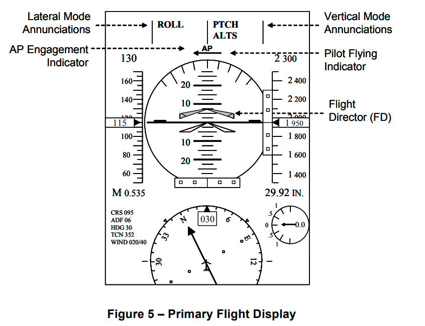

https://ntrs.nasa.gov/api/citations/20140004055/downloads/20140004055.pdf

## Formal Methods Case Studies for DO-333

## 摘要
RTCA DO-333, DO-178C和DO-278A的正式方法补充，为希望在机载系统和空中交通管理系统认证中使用正式方法的软件开发人员提供指导。补充说明了对DO-178C和DO-278A目标、活动和软件生命周期数据的修改和补充，当正式方法被用作软件开发过程的一部分时，这些数据应该被处理。
**本报告提出了三个案例研究，描述了使用不同类别的形式化方法来满足通用航空电子设备示例的认证目标-双通道飞行制导系统。
这三个案例研究说明了定理证明、模型检查和抽象解释的使用。**
所提供的材料并不代表完整的认证工作。相反，目的是说明如何在现实的航空电子软件开发项目中使用形式化方法，重点关注可用于满足DO-178C第6节中发现的验证目标的证据。

## 介绍 
RTCA DO-333是DO-178C和DO-278A的正式方法补充，为希望在机载系统和空中交通管理系统认证中使用正式方法的软件开发人员提供了指导。补充确定了DO-178C目标、活动和软件生命周期数据的修改和补充，当正式方法被用作软件开发过程的一部分时，这些数据应该被处理。这包括将使用一些正式符号表示的工件，以及可以从它们派生出来的验证证据。

本报告提供了三个案例研究，描述了使用不同类别的形式化方法来满足DO-178C认证目标。所提供的材料并不代表完整的认证工作。相反，目的是说明如何在现实的航空电子软件开发项目中使用形式化方法，重点关注可用于满足DO-178C第6节中发现的验证目标的证据。

案例研究考察了一个常见航空电子设备示例的不同方面——如图1所示的双通道飞行制导系统(FGS)。虽然不打算作为一个完整的例子，但它代表了实际航空电子开发项目中遇到的问题，并包括**使用PVS, MATLAB Simulink/Stateflow®和C源代码指定的设计工件**。这些文件可从发布本报告的同一站点下载和使用，不受任何限制。第2节提供了这个示例的描述。

这三个案例研究说明了**定理证明、模型检查和抽象解释的使用**。这些技术各有优缺点，每种技术都可以应用于不同的生命周期数据项和不同的目标。本文的目的是说明每种技术的合理应用，以满足认证目标。

DO-333提供了适用于使用正式方法时的整个验证过程的通用指南。这包括要求使用具有明确的、数学定义的语法和语义的形式符号，所使用的形式分析方法的可靠性，以及在每个形式分析中使用的所有假设的合理性。提供了具体的指导，以描述如何在DO-178C中定义的每个验证活动和目标中应用正式方法。

如图2所示，**定理证明应用于高级需求的验证，模型检查应用于低级需求和软件体系结构的验证，抽象解释应用于源代码的验证**。

将定理证明应用于FGS两通道同步的高级要求的验证，重点关注DO-333表FM.A-3的目标。**定理证明通常被认为是最强大、最通用的形式化方法，但它也是自动化程度最低的，通常需要大量的专业知识和用户培训**。本案例研究在第3节中描述。

模型检查应用于验证单个FGS通道的模式逻辑的低级要求，重点关注DO-333表FM.A-4的目标。**当前的模型检查工具非常强大，比定理证明器提供了更多的自动化。一般来说，需要的用户专业知识较少，但是用户必须能够指定要用正式语言分析的需求。这些工具是相对成熟的，并且(在我们看来)在这个级别上使用形式化方法的好处是最大的**。本案例研究在第4节中描述。

对实现FGS控制律之一的源代码进行抽象解释，重点关注DO-333表FM.A-5的目标。**抽象解释是三种技术中自动化程度最高的，至少在目前可用的商业工具中是这样，并且通常对用户的专业知识要求最少。部分原因是由于使用抽象解释来检查非功能需求，从而消除了正式指定需求的需要**。然而，我们应该注意到，存在更强大版本的抽象解释工具，它们需要更多的专业知识来指定和检查用户定义的抽象域。本案例研究在第5节中描述。

每个案例研究包括:
要验证的示例系统部分的一般描述
所使用的验证方法的描述，包括所产生的生命周期数据项和所使用的工具，大致对应于应该包含在软件验证计划中的一些信息
要满足的目标和产生的证据
与使用的正式方法工具相关的工具资格问题
执行的验证工作的详细描述

## 案例：双通道飞行制导系统（FGS）
FGS是整个飞行控制系统(FCS)的组成部分。它将飞机的测量状态(位置、速度和姿态)与期望状态进行比较，并生成俯仰和滚转制导命令，以最小化测量状态和期望状态之间的差异。强调FGS作用的FCS概述如图3所示。

如图3所示，**FGS子系统接受来自姿态航向参考系统(AHRS)、空气数据系统(ADS)、飞行管理系统(FMS)和导航无线电的关于飞机状态的输入。利用这些信息，它计算出提供给自动驾驶仪(AP)的俯仰和侧倾制导命令。当启动时，AP将这些命令转换为飞机控制面的运动，以实现关于横向和垂直轴的命令变化**。

机组人员主要通过飞行控制面板(FCP)与FGS进行交互，如图4所示。FCP包括打开和关闭飞行指挥(FD)的开关，选择不同飞行模式的开关，如垂直速度(VS)，横向导航(NAV)，航向选择(HDG)，高度保持(ALT)和进近(APPR)，垂直速度/俯仰轮和AP断开条。FCP还向机组人员提供反馈，通过在选择模式按钮的两侧点亮灯来指示选择的模式

一些关键的控制，如Go Around按钮、AP分离开关和SYNC开关都安装在控制轭和节流阀上，并通过FCP传送到FGS。通过DCP (Display Control Panel)选择导航源，选择的导航源通过PFD路由到FGS。

如图3所示，FGS有两个物理侧面或通道，一个在飞机的左侧，一个在飞机的右侧。它们提供了通过跨通道总线相互通信的冗余实现。FGS的每个通道可以进一步分解为模态逻辑和飞行控制律。飞行控制律接受飞行器当前和期望状态的信息，并计算俯仰和滚转制导命令。如果飞行控制律的引导命令被用来控制飞机或为机组人员提供视觉提示，那么它就是有效的。一个飞行控制法则是可操作的，但还没有被激活。模式逻辑决定了在任何给定时间哪种横向和垂直操作模式是有效的(例如控制飞机或向机组人员提供视觉引导线索)和武装的(例如操作但尚未激活)。这些反过来又决定了哪些飞行控制律是有效的和武装的。这些都是在主飞行显示器(PFD)上发出或显示的，同时还有由FGS生成的飞行制导命令的图形描述。

主飞行显示器(PFD)的简化图像如图5所示。PFD显示飞机的基本信息，如空速、垂直速度、姿态、地平线和航向。活动的横向和垂直模式显示(公告)在显示器的顶部。图5中的提示信息表明，当前有效的横向模式为滚持(Roll)，有效的垂直模式为俯仰保持(Pitch)，高度选择(ALTSEL)模式已启用。

PFD中心的大球体是姿态指示器。穿过它中间的水平线是人造地平线。飞机当前的俯仰和横摇由姿态指示器中间的一个白色楔形表示。图5描绘了一架飞机在水平飞行，零滚度和零俯仰度。

俯仰和滚转制导命令在PFD上的图形表示被称为飞行指导(FD)。俯仰和滚转引导指令显示为天空/滚地球中的灰色楔形。当AP不参与时，这些被解释为对飞行员的指导。当AP启动时，这些指示指示飞机由AP驾驶的方向。AP启动由模式提示下直接显示的字母AP表示。图5描述了一架飞机，其中AP被接合，FD命令飞行员将俯仰上升7.5度。

在大多数飞行模式下，FGS以依赖模式工作，只有一个FGS通道处于活动状态，为FD和AP提供引导。另一个FGS通道作为热备，设置自己的模式与活动端的模式相匹配。这是由直接显示在模式通告下面的飞行员飞行指示器指示的，该指示器指向飞行员飞行(主动)一侧。在一些更关键的模式中，如进近、起飞和复飞，FGS在独立模式下工作，两个通道都是活动的，并且独立地计算制导命令，这些命令必须同意AP参与。

### 案例研究1：定理证明
两种不同的交互式定理证明工具的使用:PVS和HOL4。

第3.1节提供了FGS系统的概述以及我们将在本案例研究中验证的功能。
第3.2节描述软件验证计划，确定要产生的生命周期数据项、要满足的DO-178C目标和工具确认问题。
3.3节描述了同步示例，包括如何在PVS中指定组件，如何由组件组成整个系统，以及如何验证系统需求。
第3.4节通过为每个组件引入独立时钟，将同步示例扩展到异步情况，并重复验证。
最后，第3.5节给出了使用HOL4的同步示例的另一种规范和验证。

#### FGS系统的概述以及我们将在本案例研究中验证的功能
整个FGS系统有两个物理侧面或通道，一个在飞机的左侧，一个在飞机的右侧。它们提供了通过跨通道总线相互通信的冗余实现，如图6所示

大多数情况下，FGS以依赖模式运行，其中只有一个FGS通道是激活的，并为FD和AP提供指导。在这种模式下，机组人员可以通过按位于FCP上方的转换开关来选择左或右FGS是激活的还是飞行员飞行的一侧。
另一端作为热备，将其模式设置为与主用端的模式一致。在一些更关键的模式中，如进近、起飞和复飞，FGS在独立模式下工作，两个通道都是活动的，并且独立地计算制导命令，这些命令必须同意AP参与，而不管哪一方是当前飞行员飞行的一方。

在这个例子中，有五个与飞行员飞行侧同步相关的系统级需求。非正式地说，它们是:
至少有一侧为飞行员飞行侧。
最多有一面是飞行员的飞行面。
按转换开关应始终改变飞行员飞行侧。
系统应以主侧作为飞行员飞行侧启动。
除非按下转换开关，否则系统不能改变飞行员飞行侧。

请注意，这些需求是系统级需求，包括FGS的两侧和它们之间的跨通道总线。

图6的概述没有说明两个FGS是同步执行还是异步执行。在一些设计中，例如在时间触发架构(TTA)中，所有组件都由单个主时钟驱动并同步执行。在其他架构中，例如航空电子全双工交换以太网(AFDX)，每个组件都由自己的本地时钟驱动，并且组件之间相对异步执行。

在这个案例研究中，我们首先开发了一个同步设计，其中所有组件都由单个主时钟驱动。我们为每个FGS端和跨通道总线开发了一套高级要求，完全不涉及设计细节。**使用定理证明，我们通过证明至少有一个满足高级组件需求的具体实现来证明这些高级需求是一致的(即不相互矛盾)。然后，我们通过证明同步设计满足了系统需求，并实例化了任何满足高级组件需求的组件，从而表明系统架构和组件的高级需求符合系统需求。然后，我们通过为每个组件引入独立时钟，将这个示例扩展到更复杂的异步情况**。

#### 软件验证计划，确定要产生的生命周期数据项、要满足的DO-178C目标和工具确认问题。

在本案例研究中，我们将使用定理证明来验证软件需求过程的输出(DO-178C Section 5.1)，重点关注DO-178C和表FM中表A-3的目标。DO-333中的A-3。这些验证活动的目的是检测在软件需求过程中可能引入的任何错误。具体而言，本案例研究将验证FGS飞行员飞行侧同步的高级软件需求，并表明系统架构、高级软件需求和高级硬件需求符合系统需求。

##### 正式的规格和验证工具
PVS正式规范语言将用于指定系统架构、系统需求、系统组件的高级软件和硬件需求，以及系统组件的候选低级软件和硬件需求。所有形式性质的验证将使用PVS定理证明系统进行。

##### 生命周期数据项
使用PVS正式规范语言为同步和异步示例提供了生命周期数据项。为了便于对两个示例进行比较，每个示例中的可比较数据项使用相同的名称。
**系统架构** 系统架构由PVS理论Pilot_Flying_System描述。该理论描述了系统组件如何在整个系统中相互作用。
**系统需求** 在PVS理论Pilot_Flying_System_Requirements中以定理的形式表述。在PVS中开发了机器检查证明，以证明系统架构和系统组件的高级需求满足这些需求。
**高级软件需求** 在Side_HLR理论中为每个FGS端指定了高级软件需求。该理论使用公理和未解释的类型、常量和函数来消除需求中的设计细节。通过证明至少存在一个具体的实现来证明公理的一致性
**低级软件需求** 候选低级需求在Side_LLR理论中为FGS 侧指定。该理论使用解释型类型、常量和函数来定义构造一致的规范。Side_Interpretationtheory用于证明低级需求符合(即实现)高级需求，证明高级需求是一致的。
**高级硬件需求** 在Bus_HLR理论中指定了跨通道总线的高级硬件要求。该理论使用公理和未解释的类型、常量和函数来消除需求中的所有设计细节。通过证明至少存在一个满足公理的具体实现来证明公理的一致性。
**低级硬件需求** 候选的低级需求在Bus_LLR理论中为跨通道总线指定。该理论使用解释型类型、常量和函数来定义按构造一致的规范。Bus_Interpretation理论用于证明底层需求符合(即:实现)高级需求，证明高级需求是可行的。

每个FGS端和跨通道总线的底层需求的存在主要是为了证明高层需求是一致的。虽然它们可以用作开发的实际低层需求，但更可能的情况是，将开发更详细的低层需求，并证明它们符合(即实现)高层需求。只要更详细的需求保持相同的接口，并被证明满足高级需求，它们就可以代替低级需求，而不会使系统需求的验证失效。

##### 需要满足的目标
#### PVS和HOL4的简介
##### 原型验证系统(Prototype Verification System, PVS)
PVS通常是与支持工具和自动定理证明器集成的规范语言。它是自1993年以来在加州门洛帕克的SRI国际计算机科学实验室开发的。当我们创建或应用新功能时，它基本上是研究原型，随着它的发展和改进，以及随着实际使用的压力暴露出所有新需求。PVS规范语言通常基于经典的、类型化的高阶逻辑。这种规范语言是指定理论库所必需的。原型验证系统(PVS)还包括用于验证的类型检查器、内置理论和定理证明器。**因此，不同的应用程序使用PVS只是为了为其系统属性提供正式的验证支持。PVS定理证明器基本上是基本推理规则和高级证明策略的集合**。它在序贯演算框架之间进行交互应用。

PVS在检查表格规范时自动生成与完整性和一致性相关的不同定理。在PVS中，定理在不同类型的构造函数的帮助下以一种简单的方式公式化。
PVS通常自动验证。通过这种验证，PVS可以简单地验证与完整性和一致性相关的各种定理。
PVS还借助了经典逻辑和全函数。另一方面，它还提供了谓词和依赖类型，这些类型在约束本来是部分函数的域时很有用。
PVS还在创建类型检查条件(tcc)时对理论进行解析和类型检查。
PVS还生成文档，如PostScript、HTML等形式的理论和证明。

#### 同步飞行员飞行示例
四个主要组件组成，Left_Side FGS Right_Side_FGS、和连接两侧的LR_Bus、RL_Bus。如图所示

假设所有四个组件都由相同的主时钟驱动并同步执行。每个FGS产生一个Pilot_Flying_Side布尔输出，表明它是否认为自己是当前的飞行员飞行方。两个总线将一方产生的值传递给另一方，从而在流程中引入一步延迟。每个FGS接受一个布尔值作为输入，表示Transfer_Switch的当前值。并且Pilot_Flying_Side值从总线的另一边传递过来。每个FGS还接受一个布尔常量，指示是否是Primary_Side将成为初始飞行员飞行侧。将Left_Side的常量设置为true，使其成为初始飞行员飞行侧，而将Right_Side的输入设置为false。中间连接C1、C2、C3和C4也在图上进行了标记，以便于讨论形式规范和证明。

同步Pilot Flying示例中的每个总线都通过一步将其输入转换为输出
延迟。指定此行为的PVS理论如图8所示。

原文内容极其详细。

##### 高阶逻辑(Higher Order Logic 4, HOL4)
在HOL4符号中，“~”为“非”运算符，“/\”为合取，“\/”为析取，“T”为真，“F”为假。“!”符号代表“所有”，而“?”符号是“存在”。最后，' <| '和' |> '是用来表示记录结构的。

### 案例研究2：模型校验
本章演示了使用模型检查来验证FGS单侧模式逻辑的正确性。FGS模式逻辑虽然相当复杂，但仅由布尔输入和输出组成。这使得它非常适合于使用广泛的**模型检查器进行正式验证**，包括基于隐式状态BDD的模型检查器，如NuSMV，以及基于可满足模理论(SMT)的模型检查器，如Kind。虽然仅由布尔逻辑组成的模型非常适合模型检查，但大多数模型检查器也可以处理带有枚举类型和小整数的模型。基于smt的模型检查器(如Kind)如果不涉及非线性算法，也可以处理实数模型。本章的其余部分组织如下。第4.1节提供了FGS模式逻辑的概述。4.2节描述了模式逻辑的软件验证计划，**确定了要产生的生命周期数据项、要满足的DO-178C目标和工具确认问题**。第4.3节提供了作为MATLAB Simulink/Stateflow模型的模式逻辑的详细规范。第4.4节讨论了使用Kind模型检查器和Simulink Design VerifierTM对模式逻辑进行形式化验证

### 案例研究3：抽象解释
本节演示了如何使用抽象解释来验证示例系统的一种飞行控制模式的源代码实现的正确性。航向控制律源代码由控制器的Simulink模型生成的C代码组成。我们将使用Polyspace和Astree抽象解释工具检查与代码运行时行为相关的各种非功能属性。本章的其余部分组织如下。第5.1节概述了Heading Control模型以及由此生成的源代码。它还描述了将由抽象解释检查的属性类型。第5.2节描述了航向控制源代码的软件验证计划，确定了要生成的生命周期数据项、要满足的DO-178C目标和工具资格问题。第5.3节和5.4节分别描述了使用Astree和Polyspace的正式验证结果。