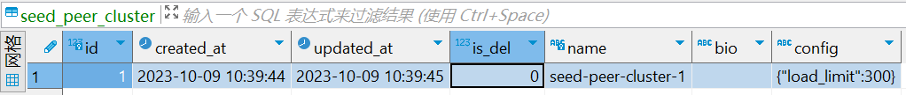
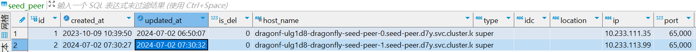
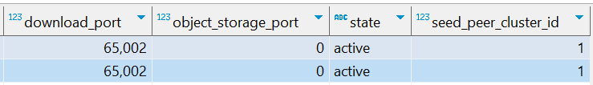
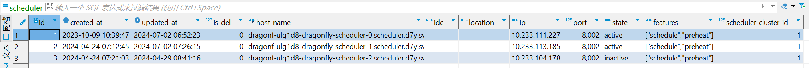

## ListSchedulers 函数

目的；希望能在trainer中获取到scheduler的相关信息，为每一个scheduler构建一个base_model.

```go
// List acitve schedulers configuration.
func (s *managerServerV1) ListSchedulers(ctx context.Context, req *managerv1.ListSchedulersRequest) (*managerv1.ListSchedulersResponse, error) {
    log := logger.WithHostnameAndIP(req.Hostname, req.Ip)
    log.Debugf("list schedulers, version %s, commit %s", req.Version, req.Commit)
    metrics.SearchSchedulerClusterCount.WithLabelValues(req.Version, req.Commit).Inc()

    // Cache hit. 
    // 传输的参数结构中有hostname 和ip ，是想找到该peer对应的schedulers.先从cache中找。
    var pbListSchedulersResponse managerv1.ListSchedulersResponse
    cacheKey := pkgredis.MakeSchedulersKeyForPeerInManager(req.Hostname, req.Ip)

    if err := s.cache.Get(ctx, cacheKey, &pbListSchedulersResponse); err != nil {
        log.Warnf("%s cache miss because of %s", cacheKey, err.Error())
    } else {
        log.Debugf("%s cache hit", cacheKey)
        return &pbListSchedulersResponse, nil
    }

    // Cache miss and search scheduler cluster.
    // 使用 Go 语言和 GORM（一个流行的 Go 语言 ORM 库）来从数据库中获取 SchedulerCluster 数据的。
    var schedulerClusters []models.SchedulerCluster
    if err := s.db.WithContext(ctx).Preload("SeedPeerClusters.SeedPeers", "state = ?", "active").
        Preload("Schedulers", "state = ?", "active").Find(&schedulerClusters).Error; err != nil {
        return nil, status.Error(codes.Internal, err.Error())
    }

    // Remove schedulers which not have scehdule featrue. As OceanBase does not support JSON type,
    // it is not possible to use datatypes.JSONQuery for filtering.
    var tmpSchedulerClusters []models.SchedulerCluster
    for _, schedulerCluster := range schedulerClusters {
        var tmpSchedulers []models.Scheduler
        for _, scheduler := range schedulerCluster.Schedulers {
            if slices.Contains(scheduler.Features, types.SchedulerFeatureSchedule) {
                tmpSchedulers = append(tmpSchedulers, scheduler)
            }
        }

        if len(tmpSchedulers) != 0 {
            schedulerCluster.Schedulers = tmpSchedulers
            tmpSchedulerClusters = append(tmpSchedulerClusters, schedulerCluster)
        }
    }
    log.Debugf("list scheduler clusters %v with hostInfo %#v", getSchedulerClusterNames(tmpSchedulerClusters), req.HostInfo)

    // Search optimal scheduler clusters.
    // If searcher can not found candidate scheduler cluster,
    // return all scheduler clusters.
    var (
        candidateSchedulerClusters []models.SchedulerCluster
        err                        error
    )
    candidateSchedulerClusters, err = s.searcher.FindSchedulerClusters(ctx, tmpSchedulerClusters, req.Ip, req.Hostname, req.HostInfo, logger.CoreLogger)
    if err != nil {
        log.Error(err)
        metrics.SearchSchedulerClusterFailureCount.WithLabelValues(req.Version, req.Commit).Inc()
        candidateSchedulerClusters = schedulerClusters
    }
    log.Debugf("find matching scheduler cluster %v", getSchedulerClusterNames(candidateSchedulerClusters))

    schedulers := []models.Scheduler{}
    for _, candidateSchedulerCluster := range candidateSchedulerClusters {
        for _, scheduler := range candidateSchedulerCluster.Schedulers {
            scheduler.SchedulerCluster = candidateSchedulerCluster
            schedulers = append(schedulers, scheduler)
        }
    }

    // Construct schedulers.
    for _, scheduler := range schedulers {
        seedPeers := []*managerv1.SeedPeer{}
        for _, seedPeerCluster := range scheduler.SchedulerCluster.SeedPeerClusters {
            for _, seedPeer := range seedPeerCluster.SeedPeers {
                seedPeers = append(seedPeers, &managerv1.SeedPeer{
                    Id:                uint64(seedPeer.ID),
                    Hostname:          seedPeer.Hostname,
                    Type:              seedPeer.Type,
                    Idc:               seedPeer.IDC,
                    Location:          seedPeer.Location,
                    Ip:                seedPeer.IP,
                    Port:              seedPeer.Port,
                    DownloadPort:      seedPeer.DownloadPort,
                    ObjectStoragePort: seedPeer.ObjectStoragePort,
                    State:             seedPeer.State,
                    SeedPeerClusterId: uint64(seedPeer.SeedPeerClusterID),
                })
            }
        }

        // Marshal features of scheduler.
        features, err := scheduler.Features.MarshalJSON()
        if err != nil {
            return nil, status.Error(codes.DataLoss, err.Error())
        }

        pbListSchedulersResponse.Schedulers = append(pbListSchedulersResponse.Schedulers, &managerv1.Scheduler{
            Id:                 uint64(scheduler.ID),
            Hostname:           scheduler.Hostname,
            Idc:                scheduler.IDC,
            Location:           scheduler.Location,
            Ip:                 scheduler.IP,
            Port:               scheduler.Port,
            State:              scheduler.State,
            Features:           features,
            SchedulerClusterId: uint64(scheduler.SchedulerClusterID),
            SeedPeers:          seedPeers,
        })
    }

    // If scheduler is not found, even no default scheduler is returned.
    // It means that the scheduler has not been started,
    // and the results are not cached, waiting for the scheduler to be ready.
    if len(pbListSchedulersResponse.Schedulers) == 0 {
        return &pbListSchedulersResponse, nil
    }

    // Cache data.
    if err := s.cache.Once(&cachev9.Item{
        Ctx:   ctx,
        Key:   cacheKey,
        Value: &pbListSchedulersResponse,
        TTL:   s.cache.TTL,
    }); err != nil {
        log.Error(err)
    }

    return &pbListSchedulersResponse, nil

}
```


代码段解读

```Go
var schedulerClusters []models.SchedulerCluster
if err := s.db.WithContext(ctx).Preload("SeedPeerClusters.SeedPeers", "state = ?", "active").
    Preload("Schedulers", "state = ?", "active").Find(&schedulerClusters).Error; err != nil {
    return nil, status.Error(codes.Internal, err.Error())
}
```

通过Dbeaver 数据库查看，是从SeedPeerClusters去管理SeedPeers，找到其active状态的seedpeer

SeedPeerClusters主要是确认是是否是删除的状态

SeedPeers 确认其激活状态


以此去找对应集群的scheduler


因此我们想实现trainer找到所有的scheduler 来init 一个初始化的base_model，只用从Scheduler里面preheat就行了。
当然这里我只考虑单个cluster部署，多个的话还要考虑trainer所属集群，然后获取到对应集群的scheduler。

这里我打算在d7y里面把protoc 给实现了，毕竟api是无法上传并公布的，所有的api都在pkg里面自己重新实现。