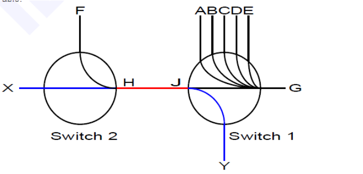

参考blog ：https://blog.csdn.net/yizhiniu_xuyw/article/details/126052568

网络拥塞问题：
在网络交换机中，当入口流量大于出口流量的带宽时会发生网络拥塞。
典型的例子是多个发送方同时向同一个目的地发送网络数据。
交换机的缓存可以处理暂时的拥塞，但是当拥塞太久时，交换机的缓存就会过载。
当交换机缓存过载时，下一个收到的新的数据包就会被丢弃。
丢包会降低应用性能，因为重传和传输协议的复杂性会带来延迟。

无损网络实现了流控制机制，它可以在缓存溢出前暂停入口流量，阻止了丢包现象。然而，流控制本身会造成拥塞传播的问题。

为了理解拥塞传播问题，考虑下面的图示。假设交换机1上的端口A到E都在向端口G发送网络数据包，以至于端口G以100%的能力来接收数据并且转发。
假设，毗邻的交换机2端口F也在向交换机1的端口G发送数据，速率是整个链路带宽的20%。因为端口G的出口已经满载了，端口F将会重传数据包直到被流控制机制暂停。此时，端口G将会出现拥塞，然而此时没有负效应，因为所有的端口都会被端口G尽快的服务。

现在考虑交换机2上的一个端口X，以链路带宽的20%速度向交换机1上的端口Y发送数据。端口G这个拥塞源并不处于端口X到端口Y的路径上。这种情况下，你也许会认为端口F只使用了交换机间链路的20%带宽，剩余的80%带宽对于端口X是可用的。然而并非如此，因为来自端口F的流量最终触发流控制机制使得交换机间的链路处于暂停发送，并且将来自端口X的流量降为20%而不是潜在可用的80%带宽。

