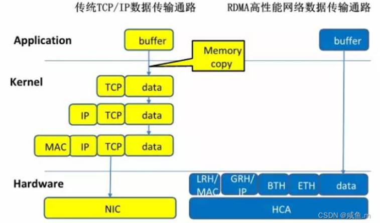

RDMA（Remote Direct Memory Access，远程直接内存访问）是一种为了解决网络传输中服务器端数据处理延迟而产生的技术。

RDMA将用户应用中的数据直接传入服务器的存储区，通过网络将数据从一个系统快速传输到远程系统的存储器中，消除了传输过程中多次数据复制和文本交换的操作，降低了CPU的负载。

简而言之，使用RDMA不需要多次数据拷贝以及中断处理，不经过操作系统内核态，当然也就没有上下文切换，也不需要CPU参与，消耗资源，相较于TCP/IP有巨大的优势，因此广泛应用于HPC(High performance computing)高性能计算中。

参考blog
https://blog.csdn.net/qq_37207042/article/details/131195591