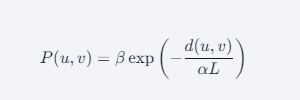

Waxman随机图是一种用来模拟物理网络，如电信网络或者互联网基础设施的图模型。这种模型最早由B. M. Waxman在1988年提出，主要用于生成具有地理特性的网络拓扑结构。

在Waxman随机图中，节点被随机地分布在一个区域（通常是一个矩形或者平面上）内。然后，图中的每对节点之间按照一定的概率连接边，这个概率与节点之间的欧几里得距离成指数关系，具体公式为：

$P(u,v)$ 是节点 $u$ 和节点 $v$ 之间形成边的概率。

$d(u,v)$ 是节点 $u$ 和节点 $v$ 之间的欧几里得距离。

$L$ 是考虑的区域的最大可能距离，例如矩形对角线长度。

$\alpha$ 和 $\beta$ 是模型参数，$\alpha$ 控制边缘距离的影响，$\beta$ 调整边缘密度。

通过调整 $\alpha$ 和 $\beta$ 的值，可以模拟不同类型的网络特性。较高的 $\beta$ 值会导致边更加密集，而较大的 $\alpha$ 值意味着距离的影响减少，远距离的连接变得更加可能。

Waxman随机图因其简单和灵活性，被广泛应用于网络科学、计算机网络以及其他需要考虑地理布局的网络研究中。