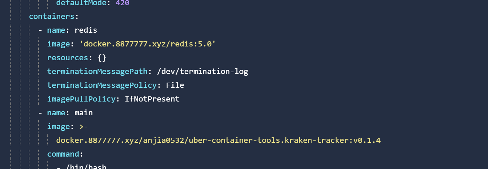
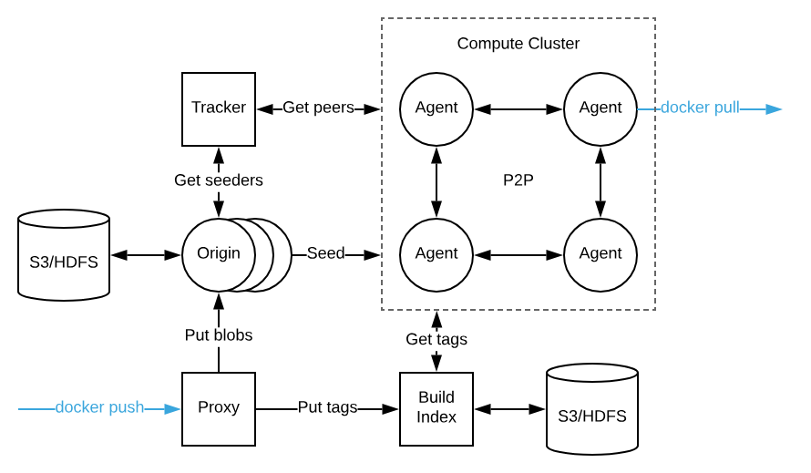

# 采用Helm charts 的方式部署kraken

具体链接：https://github.com/uber/kraken/tree/master/helm

值得注意的是，用的镜像源是gcr.io的谷歌镜像源，需要用别的方法代理一下。

可以参考好心人的帮助
https://github.com/anjia0532/gcr.io_mirror

而且kraken 的地址也在issues 里面有

https://github.com/anjia0532/gcr.io_mirror/issues?q=is%3Aissue+is%3Aclosed+kraken

具体地址需要改成

即可运行

# kraken的简单介绍

Agent
部署在每台主机上
实现Docker注册表接口
向Tracker宣布可用内容
连接到由Tracker返回的对等节点以下载内容

Origin
专用种子
将blobs作为文件存储在磁盘上，由可插入存储（例如S3， GCS， ECR）支持，
形成自修复哈希环来分配负载

Tracker
跟踪哪些节点有哪些内容（进行中的和完成的）
为任何给定的blob提供要连接到的对等点的有序列表

Proxy
实现Docker注册表接口
上传每个图像层到负责的原点（记住，原点形成一个哈希环）
上传标签到build-index

Build-Index
人类可读标记到blob摘要的映射
没有一致性保证：客户端应该使用唯一的标签
在集群之间进行镜像复制（简单的复制队列，可重试）将标签作为文件存储在磁盘上，支持可插拔存储（例如S3， GCS， ECR）