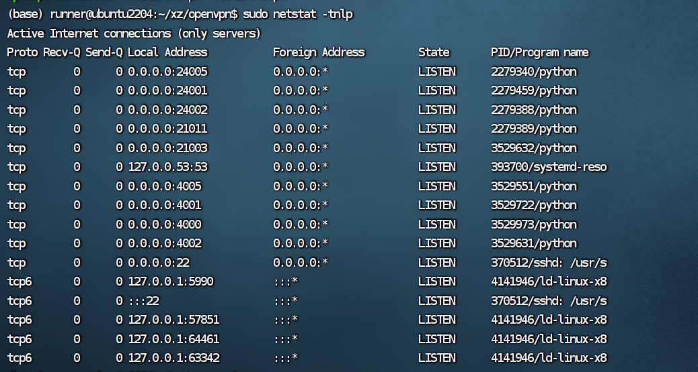

参考学习 https://blog.csdn.net/m0_56015193/article/details/134590283

三台机器的openvpn搭建

|     | 映射ip| 映射端口| 内网ip| GPU|
|----------:|----------:|----------:|----------:|----------:|
|1|210.30.97.178| 2222|  192.168.1.170|NVIDIA A100-SXM4-80GB * 1|
|2|210.30.97.179| 2222|  192.168.1.144|NVIDIA A100-SXM4-80GB * 2|
|3|210.30.97.181| 2222|  192.168.2.183|NVIDIA A100-SXM4-80GB * 2|

## VPN搭建

https://github.com/angristan/openvpn-install

默认端口为1194

查看端口
netstat -tnlp 

为啥没有1194？

## client 端安装
https://community.openvpn.net/openvpn/wiki/OpenvpnSoftwareRepos#InstallingOpenVPN
