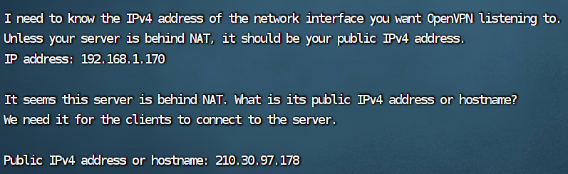
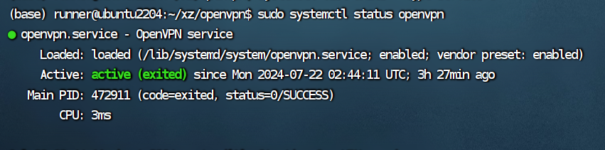
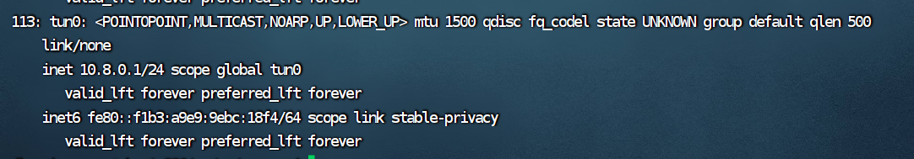

参考学习 https://blog.csdn.net/m0_56015193/article/details/134590283

三台机器的openvpn搭建

|     | 映射ip| 映射端口| 内网ip| GPU| tun0|后台网页访问ip|
|----------:|----------:|----------:|----------:|----------:|----------:|----------:|
|1|210.30.97.178| 2222|  192.168.1.170|NVIDIA A100-SXM4-80GB * 1|10.8.0.1|210.30.97.144|
|2|210.30.97.179| 2222|  192.168.1.144|NVIDIA A100-SXM4-80GB * 2|10.8.0.2|210.30.97.145|
|3|210.30.97.180| 2222|  192.168.1.155|NVIDIA A100-SXM4-80GB * 2|10.8.0.7|210.30.97.146|
|4|210.30.97.181| 2222|  192.168.2.183|NVIDIA A100-SXM4-80GB * 2|10.8.0.3|210.30.97.147|

## VPN搭建

https://github.com/angristan/openvpn-install

默认端口为1194

查看端口
sudo ss -tupln | grep openvpn

查看server 状态
sudo systemctl status openvpn

检查网络接口，一个新的接口已经为Vpn隧道创建，可以使用iP命令确认这一点
ip add

启动OpenVpn服务，让它在系统启动时自动启动，并检查其状态以确认它已启动并正在运行
sudo systemctl start openvpn 
sudo systemctl enable openvpn 
sudo systemctl status openvpn

## client 端安装
https://community.openvpn.net/openvpn/wiki/OpenvpnSoftwareRepos#InstallingOpenVPN

就简单sudo apt-get install openvpn
然后openvpn --config ~.ovpn文件就行

用 tun0的ip 进行通信

## 踩坑

### 端口映射查看一下option proto 是什么，是tcp 的话需要修改成udp,因为默认openvpn默认配置是udp.

### client 之间不互通，需要在server.conf 文件中添加client-to-client.
把 /etc/openvpn/server.conf 配置内容添加client-to-client
重启openvpn服务
systemctl restart openvpn@server

### 关键技术：！！！！！！！就是这个折腾了很久
https://blog.csdn.net/qq_14839543/article/details/126378827
export NCCL_DEBUG=INFO
export NCCL_IB_DISABLE=1
export NCCL_SOCKET_IFNAME=tun0，这一步是最重要的

最后一个要改成vpn 的tun0隧道即可，让NCCL 走VPN 的信道

torchrun --nproc_per_node=2 --nnodes=3 --node_rank=0 --master_addr=10.8.0.3 --master_port=8001 train.py --train_args_file train_args/sft/qlora/llama2-7b-sft-qlora.json

单块的A100 的服务器会造成瓶颈，最好的分布式是大家都一样的配置，才能很好地增加参数。