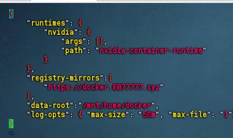
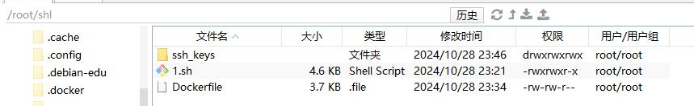

# 实验室相关服务器参数配置

服务器参数：
H3C 5300G5 2U机架式服务器： 至强银牌4314（单颗16核32线程，2.4-3.4GHZ主频）*2颗

32G DDR3200*16条=512G内存

1.92T SSD固态硬盘*1+4T SATA*1机械硬盘

P460 2G raid卡 

A6000G 48G*4块

2000W电源*4块 

这里采用nvidia-docker 的方式，启动容器镜像予以同学，方便动态配置+灵活管理

两块硬盘分别挂载的地方为：

sda->sda5 1.7T  固态 /        (设定全放容器之外的东西)

sdb->sdb1 3.6T 机械 /mnt/home (设定全放容器相关内容)

# 允许管理员用户ssh 系统
修改/etc/ssh/sshd_config 的配置文件
并将该行注释去掉并改成
```
PermitRootLogin yes
```

# 参考blog
https://blog.csdn.net/hangvane123/article/details/88639279

## 相关步骤
可以优先安装proxychains4 全局linux 代理，执行命令前加一个proxychains
https://www.cnblogs.com/websec80/p/17229733.html

## 省略源之类的更新，省略nvidia显卡驱动的更新步骤

## 安装docker
参考内容
https://docs.docker.com/engine/install/debian/

这里没有docker run hello-world 执行
而是先 安装nvidia-docker 然后生成了daemon.json的方式
https://docs.nvidia.com/datacenter/cloud-native/container-toolkit/latest/install-guide.html#installing-with-apt


需要在daemon.json 处更换镜像存储源
```
 vim /etc/docker/daemon.json
```
这里我是放在/mnt/home/docker，也就是全放在机械盘上



## 创建容器
这里用的版本为 nvidia/cuda:12.2.2-cudnn8-runtime-ubuntu22.04 作为基础镜像

docker info时候出现错误
```
WARNING: bridge-nf-call-iptables is disabled
```
这个警告意味着 Linux 内核的 iptables 防火墙桥接功能被禁用了。这个功能通常用于 Docker 容器网络配置中，以允许容器之间的通信和网络流量转发。

设置宿主机这设置linux允许内核转发，出现问题
```
sysctl: cannot stat /proc/sys/net/bridge/bridge-nf-call-iptables: No such file or directory
```
需要执行, 即可
```linux
modprobe br_netfilter
sysctl -w net.bridge.bridge-nf-call-iptables=1
```
持久化设置
编辑 /etc/sysctl.conf为你教案，末尾添加
```
net.bridge.bridge-nf-call-iptables = 1
```
执行，生效
```
sysctl -p
systemctl restart docker
```

## 打包成镜像
创建shl 文件夹，把Dockerfile 和1.sh 脚本放入
在shl文件夹中创建ssh_keys用来放置创建容器后的ssh key

在shl目录下执行
```
docker buildx build -t cuda-base:1.0 .
```
构建好镜像

然后执行1.sh
一直回车即可配置好可用镜像。