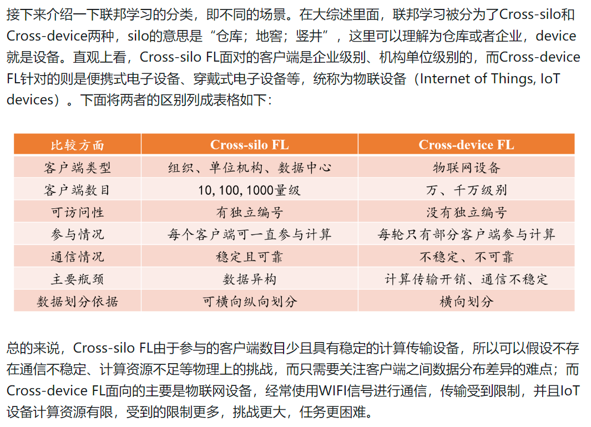
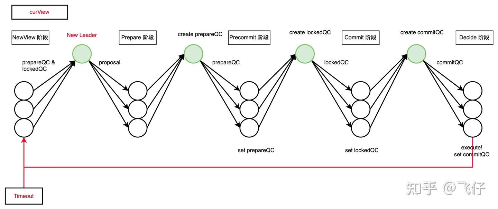

## cross-silo FL

## 拜占庭容错
改进型实用拜占庭容错（Practical Byzantine Fault Tolerance/PBFT）
PBET共识机制是少数服从多数，根据信息在分布式网络中节点间互相交换后各节点列出所有得到的信息，一个节点代表一票，选择大多数的结果作为解决办法。PBET将容错量控制在全部节点数的1/3，即如只要有超过2/3的正常节点，整个系统便可正常运作。

## AdaKrum 过滤掉中毒梯度
“Machine learning with adversaries: Byzantine tolerant gradient descent”

什么鬼？

## HotStuff 共识的理解与实现
《HotStuff: BFT Consensus in the Lens of Blockchain》

Basic HotStuff 为四阶段，其中 NewView 阶段是 Decide 阶段中 replica 收到 commitQC 后或者共识期间出现异常（Timeout）时主动触发的。

NewView 阶段：切换视图，且选出新 Leader，（如果不用切换 leader 可跳过这个阶段，因为旧 Leader 保留了最新的视图状态 ，不需要 Replica 同步），并且保证新 leader 打包的新提案不和大多数节点状态冲突，同时解决部分还未执行 Decide 的状态不一致问题。具体来说，Replica 需要将自己的 prepareQC 和 lockedQC 状态、下一个视图的 curView 号发送给新 leader，新 leader 打包出新的提案，并使用新的 curView 号发布提案。

Prepare 阶段：leader 广播提案供 Replica 校验是否冲突，Leader 收集 > 2/3 的同意 Vote后，生成 prepareQC。

Precommit 阶段： Leader 广播 prepareQC 给 Replica，Replica 设置 prepareQC，拥有 prepareQC 代表承认此提案无冲突，并返回投票，Leader有足够票数后生成 precommitQC。

Commit 阶段：Leader 广播 precommitQC 给 Replica，Replica 设置 lockedQC，拥有 precommitQC(lockedQC) 代表此提案可以随时执行，并返回投票，Leader 有足够的票数后生成 commitQC。设置了 lockedQC 的节点表示最终确认了这个提案，lockedQC 用于和新提案检测是否冲突。

Decide 阶段：Leader 广播 commitQC 给 Replica，拥有 commitQC 表示提案已经执行完毕， Decide 阶段 Replica 收到 Decide 消息或者超时都会发送 NewView 消息选出新 leader。

https://baijiahao.baidu.com/s?id=1707872300214981737&wfr=spider&for=pc
这个讲得不错，包括S'=S+1 的状态以及S'=S+2的 状态带来的问题

假设系统某时刻收到指令S'=S+1，主节点将这条指令S'=S+1发送给非主节点（这是pre-prepare消息），因为是拜占庭问题，诚实节点不确定自己收到的是否和其他诚实节点一致（主节点发送不一致消息），节点之间需要进行一次相互通信，确定自己和其他诚实节点收到的消息一致（确定主节点没有发送不一致消息），每个节点发送prepare消息给其他所有节点，之后若收到quorum个数量的prepare消息，且通过验证（验证prepare中指向的指令与自己一致），达成第一轮共识（这是PREPARE阶段）。此时，似乎可以确定了诚实节点收到的消息一致。但是这里隐含条件是，达到共识的节点只是在自己的视角看到：我收到并验证了quorum个一致的消息。但其他节点不一定和自己一样收到quorum个prepare消息达成共识，如果此时进行提交，出现了网络故障，提交了的节点知道已经达成共识，只要等网络恢复，这条指令一定会被整个系统提交。但其他节点可能由于网络故障还未达成共识，他们无法确定一直等下去能否提交。为了让系统保持活性，进行视图切换，此时新的主节点需要确定是在S'还是S的基础上执行新的指令。如果没有发现部分节点已经提交了该指令，且对另一条指令S''=S+2进行了共识并提交，系统对变量S的取值产生了不一致。因此，在此时提交有安全性的问题。

如果再进行一个阶段的共识，在达成PREPARE共识之后，各自再发送一个commit消息，各自节点等待接受并验证quorum个commit消息之后再提交。会遇到同样的问题，达成COMMIT共识的节点提交了，他们知道如果网络正常，系统迟早都会提交，但是其他未达成COMMIT共识的节点不确定最后能否提交。网络发生故障后新视图中的主节点如果没有发现已经提交了的节点，依然会造成不一致。这里的矛盾是我们为了活性需要切换视图继续共识；为了安全性还要确保新视图开始共识前S的取值一致，已经提交了的指令在新视图中也一定需要被提交。而在PBFT中采用视图切换时向其他节点发送消息证明自己S的状态的方法，即发送自己最新的S的一条pre-prepare消息和对应的quorum条prepare消息。视图切换时，新主节点共识前就能判断S'=S+1是否需要提交。

如果没有任何一个节点就S'=S+1达成PREPARE阶段共识，则不会继续对S'=S+1进行提交。

如果存在一个节点对达成了S'=S+1达成了PREPARE阶段共识，则不可能对一条冲突的指令S''=S+2达成共识并提交，